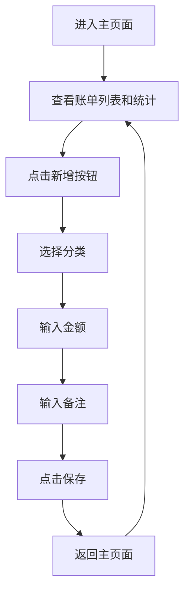

## 1. 产品概述
一个简洁优雅的账单记录应用，帮助用户轻松管理个人财务。用户可以记录收支明细，查看分类统计，随时掌握财务状况。

## 2. 核心功能

### 2.1 用户角色
| 角色 | 注册方式 | 核心权限 |
|------|----------|----------|
| 用户 | 无需注册 | 查看账单、新增账单、查看统计 |

### 2.2 功能模块
1. **主页面**: 账单列表展示、收支统计、新增按钮
2. **新建页面**: 分类选择、金额输入、备注填写

### 2.3 页面详情
| 页面名称 | 模块名称 | 功能描述 |
|----------|----------|----------|
| 主页面 | 统计区域 | 展示总收入、总支出、余额 |
| 主页面 | 账单列表 | 展示所有账单记录，包含分类图标、备注、金额、日期 |
| 主页面 | 新增按钮 | 浮动按钮，点击跳转到新建页面 |
| 新建页面 | 分类选择 | 支出和收入分类列表，支持点击选择 |
| 新建页面 | 金额输入 | 数字输入框，支持小数点 |
| 新建页面 | 备注输入 | 文本输入框，用于记录账单备注 |
| 新建页面 | 保存按钮 | 保存账单并返回主页面 |

## 3. 核心流程
用户进入主页面查看账单列表和统计 → 点击新增按钮 → 选择分类 → 输入金额和备注 → 点击保存 → 返回主页面查看更新后的账单

## 4. 用户界面设计

### 4.1 设计风格
- 主色调：清新绿色系 (#10B981)，代表财务健康和积极
- 辅助色：深灰色 (#1F2937) 用于文字，浅灰色 (#F3F4F6) 用于背景
- 按钮风格：圆润圆角 (border-radius: 12px)，渐变效果
- 字体：Inter，现代简洁
- 布局：卡片式设计，清晰的视觉层次
- 图标：使用Lucide图标库

### 4.2 页面设计概述
| 页面名称 | 模块名称 | UI元素 |
|----------|----------|--------|
| 主页面 | 统计区域 | 三个卡片横向排列，展示收入、支出、余额，带渐变背景 |
| 主页面 | 账单列表 | 垂直列表，每项包含分类图标、信息区域、金额和日期 |
| 主页面 | 新增按钮 | 右下角浮动圆形按钮，带加号图标 |
| 新建页面 | 分类选择 | 网格布局，分类项带图标和名称，选中状态高亮 |
| 新建页面 | 金额输入 | 大字体输入框，带货币符号 |
| 新建页面 | 备注输入 | 常规输入框，带占位提示 |

### 4.3 响应式设计
- 桌面端：统计卡片三列并排，列表项横向布局
- 移动端：统计卡片堆叠，列表项紧凑布局，新增按钮固定底部

### 4.4 交互效果
- 列表项点击反馈（轻微缩放）
- 分类选择动画（选中时缩放并高亮）
- 页面切换过渡效果
- 按钮悬停动画