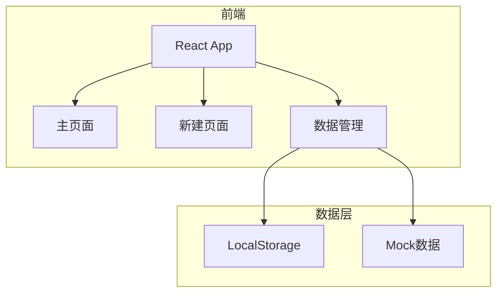
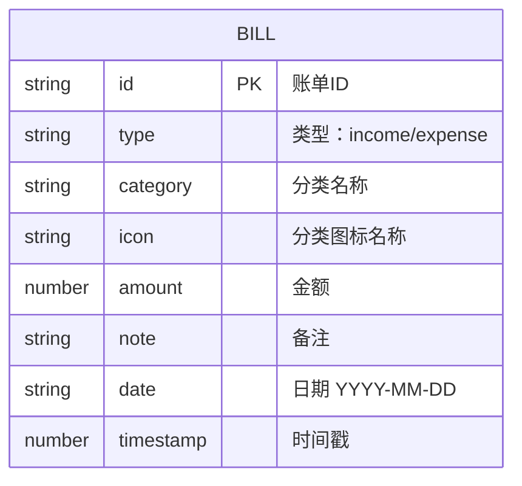

## 1. 架构设计


## 2. 技术描述
- Frontend: React@18 + tailwindcss@3 + vite
- 路由：React Router v6
- 图标：Lucide React
- 状态管理：React Context + useState
- 数据存储：LocalStorage（持久化）
- 初始化工具：vite

## 3. 路由定义
| 路由 | 用途 |
|------|------|
| / | 主页面，展示账单列表和统计 |
| /add | 新建账单页面 |

## 4. 数据模型

### 4.1 数据模型定义


### 4.2 分类数据
```typescript
interface Category {
  id: string;
  name: string;
  icon: string;
  type: 'income' | 'expense';
}
```

支出分类：餐饮、交通、购物、娱乐、居住、医疗、教育、其他
收入分类：工资、奖金、投资、兼职、其他

### 4.3 Mock数据
初始化时生成5-10条模拟账单数据，用于展示。

## 5. 项目结构
```
src/
├── components/
│   ├── StatCard.tsx        # 统计卡片组件
│   ├── BillItem.tsx        # 账单列表项组件
│   ├── CategoryGrid.tsx    # 分类选择网格组件
│   └── FloatingButton.tsx  # 浮动按钮组件
├── pages/
│   ├── Home.tsx            # 主页面
│   └── AddBill.tsx         # 新建页面
├── context/
│   └── BillContext.tsx     # 账单数据上下文
├── data/
│   └── categories.ts       # 分类数据
├── types/
│   └── index.ts            # TypeScript类型定义
├── utils/
│   └── storage.ts          # LocalStorage工具函数
├── App.tsx
├── main.tsx
└── index.css
```

## 6. 核心功能实现

### 6.1 数据持久化
- 使用LocalStorage存储账单数据
- 每次新增/删除账单时同步更新LocalStorage
- 页面加载时从LocalStorage读取数据

### 6.2 统计计算
- 遍历账单列表，按类型汇总收入和支出
- 余额 = 总收入 - 总支出

### 6.3 分类选择
- 分为收入和支出两个标签页
- 点击分类项切换选中状态
- 选中的分类传递到表单